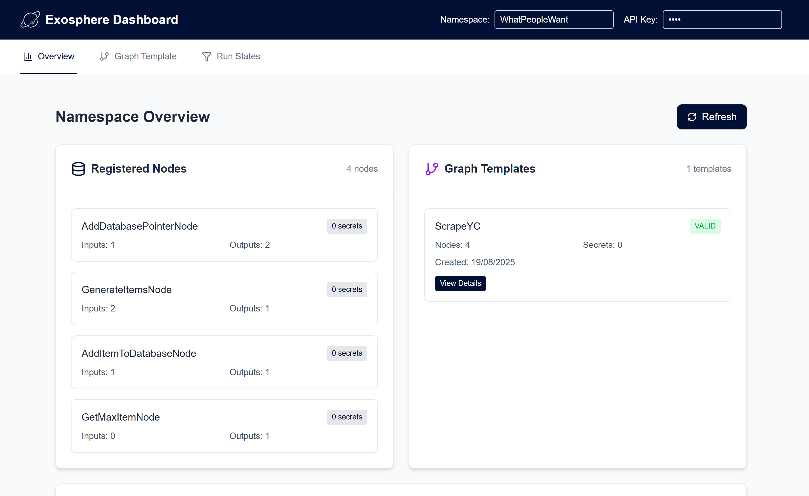
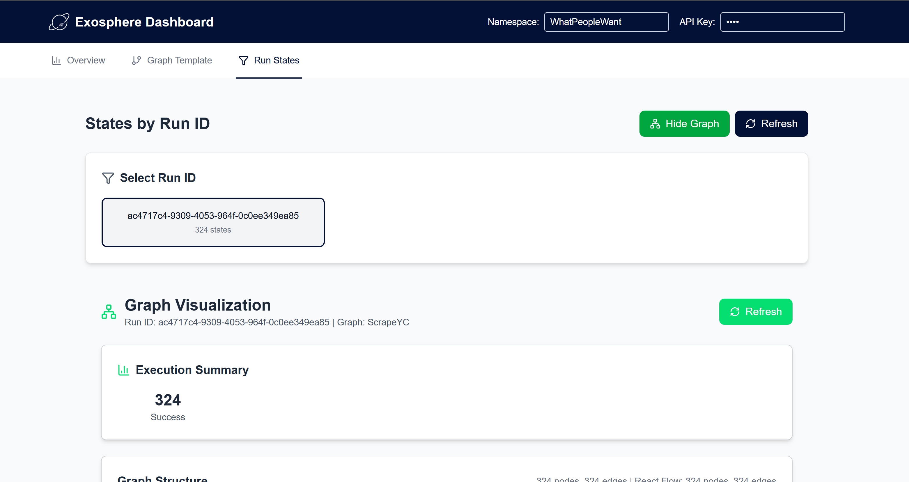
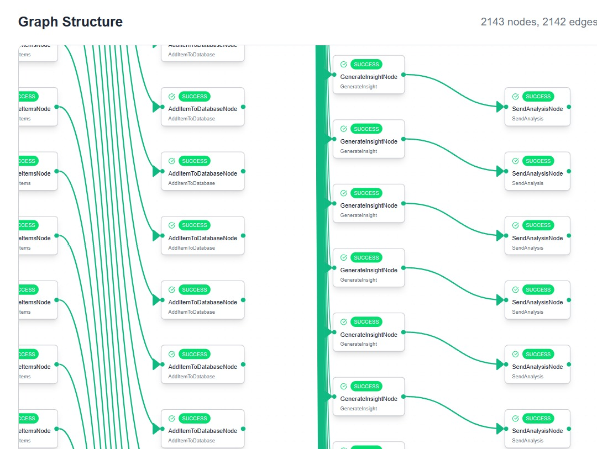

# Exosphere Dashboard

The Exosphere dashboard provides a comprehensive web interface for monitoring, debugging, and managing your workflows. This guide shows you how to set up and use the dashboard effectively.

## Dashboard Overview

The Exosphere dashboard is a modern web application that connects to your state manager backend and provides:

- **Real-time monitoring** of workflow execution
- **Visual graph representation** of your workflows
- **State management** and debugging tools
- **Performance metrics** and analytics
- **Error tracking** and resolution
- **Graph template management** and validation

## Setup Guide

### Prerequisites

Before setting up the dashboard, ensure you have:
- A running Exosphere state manager (see [State Manager Setup](./state-manager-setup.md))
- Your API key and namespace from the state manager
- Docker (for containerized deployment)

=== "Docker (Recommended)"

    The easiest way to run the dashboard is using the pre-built Docker container. This approach ensures consistent environments and minimal setup.

    #### Prerequisites

    - Docker installed

    #### Setup Steps

    1. **Pull the latest dashboard image and run**:
       ```bash
       # Pull the latest dashboard image
       docker pull ghcr.io/exospherehost/exosphere-dashboard:latest

       # Run the dashboard container
       docker run -d \
         --name exosphere-dashboard \
         -p 3000:3000 \
         -e NEXT_PUBLIC_STATE_MANAGER_URL="http://localhost:8000" \
         -e NEXT_PUBLIC_API_KEY="your-api-key" \
         -e NEXT_PUBLIC_NAMESPACE="your-namespace" \
         ghcr.io/exospherehost/exosphere-dashboard:latest
       ```

    2. **Verify the service is running**:
       ```bash
       # Check container status
       docker ps
       
       # Check logs
       docker logs exosphere-dashboard
       
       # Test the dashboard
       curl http://localhost:3000
       ```

    The dashboard will be available at `http://localhost:3000`

    #### Required Environment Variables

    | Variable | Description | Required | Default |
    |----------|-------------|----------|---------|
    | `NEXT_PUBLIC_STATE_MANAGER_URL` | State manager API endpoint | Yes | - |
    | `NEXT_PUBLIC_API_KEY` | API key for authentication | Yes | - |
    | `NEXT_PUBLIC_NAMESPACE` | Default namespace | Yes | - |
    
=== "Local Development"

    For development or customization, you can run the dashboard locally using the source code.

    #### Prerequisites

    - Node.js 18 or higher
    - npm or yarn package manager
    - Git

    #### Setup Steps

    1. **Clone the repository**:
       ```bash
       git clone https://github.com/exospherehost/exospherehost.git
       cd exospherehost/dashboard
       ```

    2. **Install dependencies**:
       ```bash
       npm install
       ```

    3. **Set up environment variables**:
       ```bash
       cp .env.example .env
       # Edit .env with your configuration
       ```

    4. **Start the development server**:
       ```bash
       npm run dev
       ```

    The dashboard will be available at `http://localhost:3000`

    #### Environment Variables

    Create a `.env` file in the dashboard directory with these variables:

    ```bash
    # State manager API endpoint
    NEXT_PUBLIC_STATE_MANAGER_URL=http://localhost:8000

    # API key for authentication
    NEXT_PUBLIC_API_KEY=your-api-key

    # Default namespace
    NEXT_PUBLIC_NAMESPACE=your-namespace
    ```

## Dashboard Interface

The Exosphere dashboard features a clean, modern interface with three main sections accessible via the navigation tabs at the top.



View registered nodes, and graph templates on a namespace




View graph runs and debug each node that was created.

## Using the Dashboard

1. **Configure Connection**:
   
      - Set your namespace in the header
      - Enter your API key
      - Ensure your state manager is running

2. **Explore Overview**:

      - Review registered nodes and their capabilities
      - Check graph template status and validation
      - Monitor namespace statistics

3. **Manage Templates**:

      - View existing graph templates
      - Create new templates using the builder
      - Validate template configurations

4. **Monitor Execution**:

      - Select specific run IDs to track
      - View real-time execution progress
      - Debug failed states and errors

### Support

For additional help:
- Check the [State Manager Setup](./state-manager-setup.md) guide
- Review [Concepts](./concepts.md) for workflow understanding
- See [Examples](./examples.md) for usage patterns

## Next Steps

- **[Examples](./examples.md)** - See real-world usage examples
- **[Concepts](./concepts.md)** - Learn about fanout, units, inputs, outputs, and secrets
- **[State Manager Setup](./state-manager-setup.md)** - Complete backend setup guide
